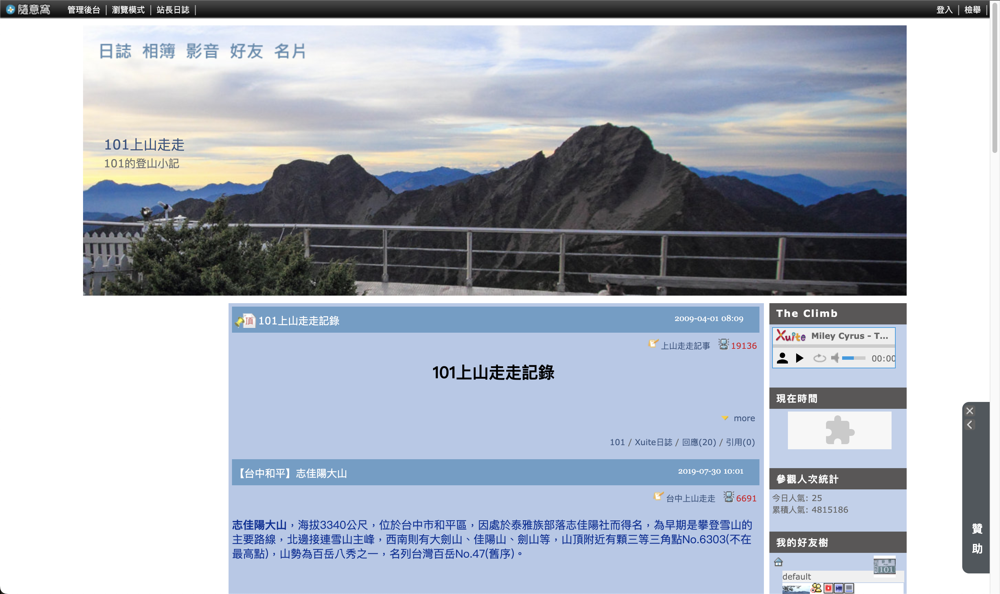

---

不曉得各位在搜尋登山資訊時是否曾經到訪過「101上山走走」部落格？

由於 Xuite 部落格即將於本月月底關站，所以我已幫忙我爸爸將部落格搬家完畢，新網站優化了在手機上的體驗，每篇文章也添加了封面照片。

10 多年來共累積了 400 多篇文章，近 400 座山或步道，  
新的網址是：[**https://1013399.github.io/**](https://1013399.github.io/)

因為 Xuite 部落格已無法再編輯，所以無法公告在原有網站，  
於是在此分享給各位，希望舊雨新知，並且幫助到各位。☺️

---

## 關於101上山走走

一般人對於沒有爬過而又有興趣的山，總是會上網找資料，網路上也有許多專業的網站及部落格，甚至記錄鉅細靡遺。

然而對我們這種業餘登山客來說，最重要的是如何到達登山口、登山路徑及難易度(落差、時程)，而且一定還要有詳細易懂的登山路線圖。

以下記錄的內容，大部份取自網路，有我整理過及採用的行車路線、登山路線及登山圖(登山圖均已註明出處，如需原圖，請點選連結至該網站或部落格)，至於時程則因每人腳程不同、休息時間各異，故個人記錄之行走時間，僅供參考。

由於記錄越來越多，此頁面開啟時間過久，特將上山走走記錄分區，以節省寶貴時間。

---

## 各地上山走走記事

- [【北北基】上山走走記錄](https://1013399.github.io/posts/post-273-2011-01-02.html)
- [【桃竹苗】上山走走記錄](https://1013399.github.io/posts/post-272-2011-01-02.html)
- [【中彰投】上山走走記錄](https://1013399.github.io/posts/post-271-2011-01-02.html)
- [【雲嘉南】上山走走記錄](https://1013399.github.io/posts/post-270-2011-01-02.html)
- [【 高屏 】上山走走記錄](https://1013399.github.io/posts/post-268-2011-01-02.html)
- [【宜花東】上山走走記錄](https://1013399.github.io/posts/post-269-2011-01-02.html)
- [【金馬澎】上山走走記錄](https://1013399.github.io/posts/post-267-2011-01-02.html)

---

## 關於開發過程

> 詳細的開發過程在下一篇文章：  
> [用 ChatGPT 部落格搬家：101上山走走 (Xuite 部落格)](/blog/chatgpt-xuite-blog-1013399/)

---

## Xuite 舊站畫面 (2023/08/24)

