有時候看電腦很久，覺得眼睛看 code 花花的，  
這時候好的環境配置就很重要，顏色對比度適中，會比較好看 code，提升工作效率。

今天跟大家分享幾個我試了後， 長期使用下來，  
我喜歡的主題、字體還有套件。

---

## 主題

### **1.** [**Glacier Theme**](https://marketplace.visualstudio.com/items?itemName=Tyriar.theme-glacier)

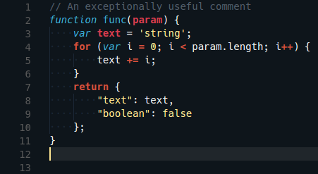

對比度高，又不會刺眼，我滿喜歡的。後來才知道設計這個樣式的人—— [Daniel Imms](https://www.growingwiththeweb.com/)，就是 VSCode 的開發人員之一。

---

### **2.** [**Material Icon Theme**](https://marketplace.visualstudio.com/items?itemName=PKief.material-icon-theme)

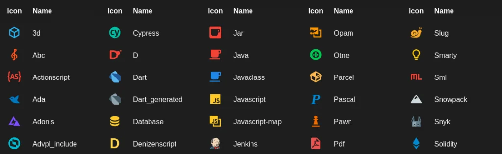

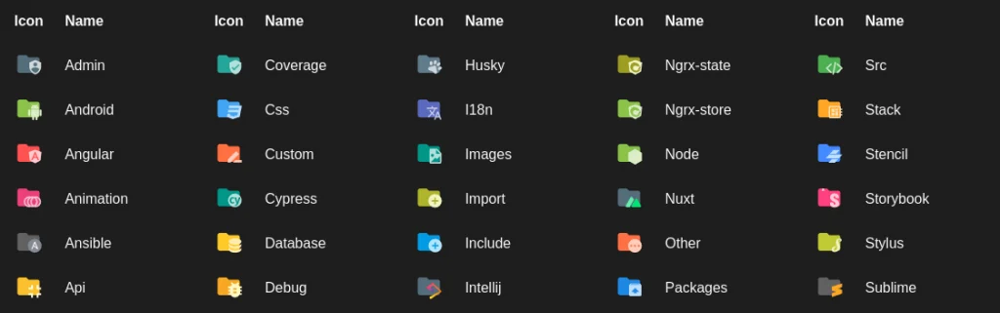

圖案很多種，資料夾也有，能想到的幾乎都有。  
而且每個對比度也夠高，也好看，我很喜歡。

---

## 字體

### **3.** [**Source Code Pro**](https://github.com/adobe-fonts/source-code-pro)

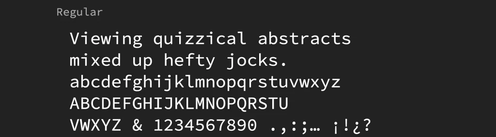

是 Adobe 開發的開源等寬字體。 我覺得簡單好看，Regular 的粗細適中。

---

## 套件

### **4.** [**indent-rainbow**](https://marketplace.visualstudio.com/items?itemName=oderwat.indent-rainbow)

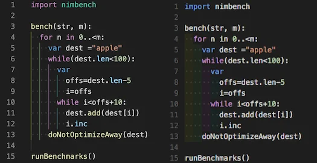

有時候 code 很長的時候（尤其是 Html），真的看得非常眼花，  
這個套件能幫助你把縮排變成彩虹，幫助非常大！

---

### **5.** [**Better Comments**](https://marketplace.visualstudio.com/items?itemName=aaron-bond.better-comments)

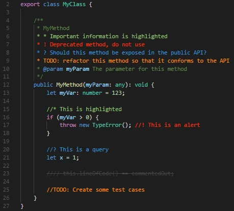
針對常見的註解寫法，有不同顏色標示， 還能透過設定檔設定更多的分類。  
也滿好用的。

---

### **6.** [**TODO Highlight**](https://marketplace.visualstudio.com/items?itemName=wayou.vscode-todo-highlight)

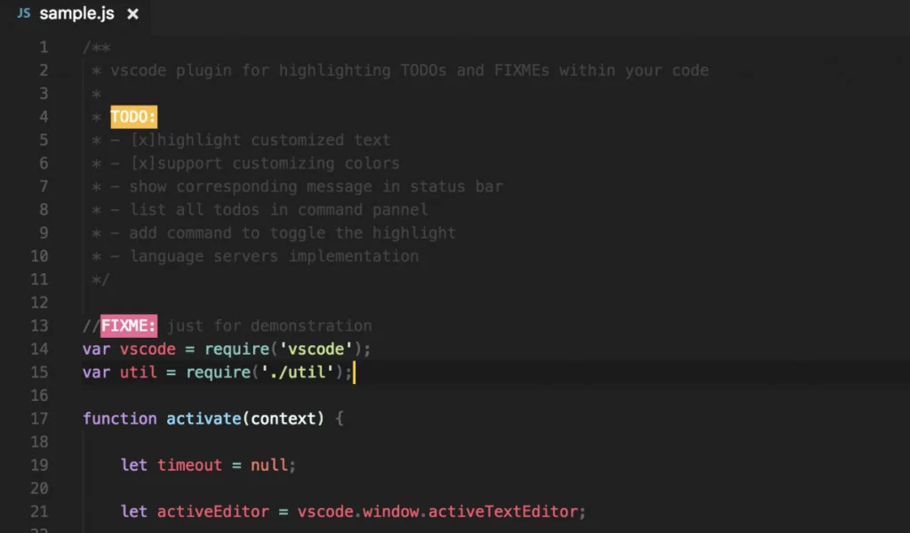

針對常見的註解寫法，會變成色塊的方式顯示。  
不過如果和 Better Comments 混用， TODO 會變成橘色字橘色背景，反而不明顯。  
建議可以擇一使用。

---

### **7.** [**Todo Tree**](https://marketplace.visualstudio.com/items?itemName=Gruntfuggly.todo-tree)

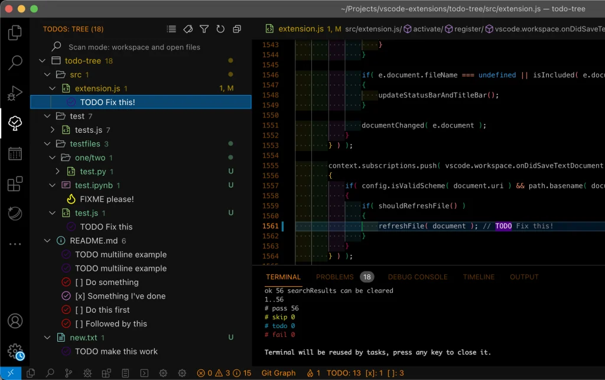

當 TODO 註解散落在各個檔案中，只能使用全域搜尋一個個找嗎？  
不，有了 Todo Tree 後，它會幫你按照資料夾分類，列出來。  
也很實用喔！

---

### **8.** [**Color Highlight**](https://marketplace.visualstudio.com/items?itemName=naumovs.color-highlight)

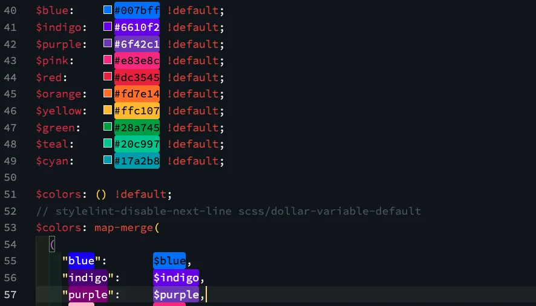

使用後 CSS 中的顏色會直接顯示為該顏色的色塊，滿直觀的。  
定義為 SCSS 變數後也會顯示顏色，推！

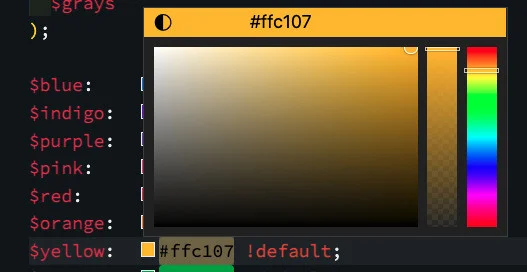

點擊前方的小色塊還能直接改顏色，只不過我通常不會這麼用。

---

### **9.** [**Code Spell Checker**](https://marketplace.visualstudio.com/items?itemName=streetsidesoftware.code-spell-checker)

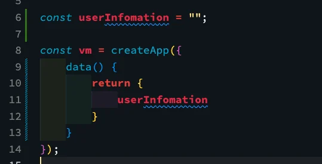

有了這個套件後，就不用擔心打字時手殘命名拼錯字， 可以避免掉因錯字而找不到該變數或 function，然後 debug 困難的情況。

它會幫你將錯字標示出來提醒你，  
例如圖片中的 userInfomation 應該是 userInfo`r`mation。  
推薦！

---

### **10.** [**Chinese Lorem**](https://marketplace.visualstudio.com/items?itemName=KevinYang.ctlorem)

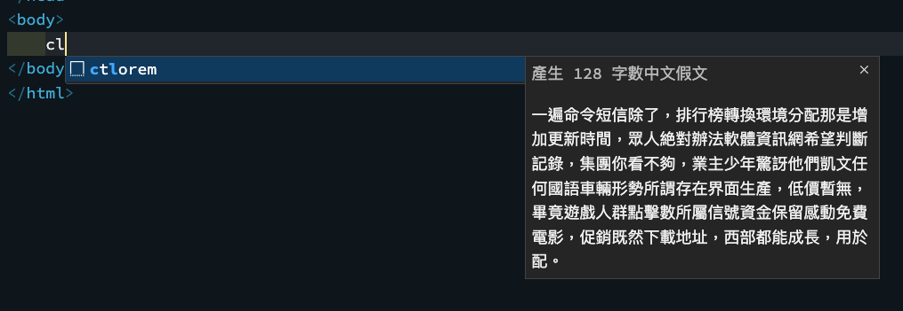

在切版時有的時候需要假字先填充內容，接近完成時的樣貌。VsCode 內建有英文的 lorem，而這個套件可以產生中文版的假字，在 HTML 的格式內，輸入 `ctlorem` 按下 `tab` 或是 `enter` 即可產生 128 個字的中文假文。

我公司是使用 .Net Core 開發， 所以 `.cshtml` 要能夠運作的話， 要另外將 `aspnetcorerazor` 設定到支援的語言中。

---

### **11.** [**Inline fold**](https://marketplace.visualstudio.com/items?itemName=moalamri.inline-fold)

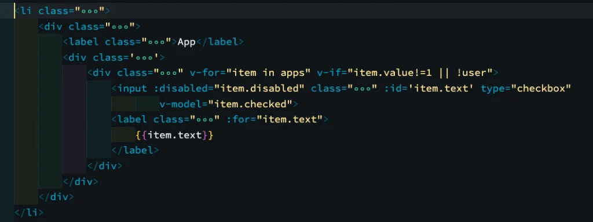

這個套件使用後能夠把你的 class name 縮起來，畫面變得清爽許多！  
預設是折疊起 class，好像 svg 也能折疊起來， 不過我還沒有試用過。

> _後記：這有個致命缺點，在編輯 vue_`v-bind:class`_一直開開合合，其實有一點不便。_  
> _如果你不常更改 class name 的話，推薦！但經常要變更的話就不推薦了。_

和上一個套件一樣，`.cshtml` 要能夠運作的話， 要另外將 `aspnetcorerazor` 設定到支援的語言中。

---

## 終端機

### Mac Terminal 設定

另外，我是使用 Mac， 我有把 VS Code 的 Terminal 改成 iTerm APP。

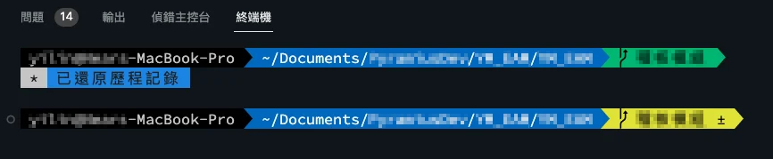

而我的 iTerm 有改過樣式，  
所以 VS Code 的 Terminal 也一起有客製的樣式啦！(開心)

分享我之前看過的教學文給大家：

1. [為 MAC 的 Terminal 上色 - 透過 iTerm 2 和 Oh My Zsh 高亮你的終端機](https://pjchender.dev/app/mac-terminal-iterm2/)
2. [在VSCode 裝個漂亮的 Terminal 介面- zsh + powerlevel10k](https://sasacode.wordpress.com/2021/06/18/%E5%9C%A8vscode-%E8%A3%9D%E5%80%8B%E6%BC%82%E4%BA%AE%E7%9A%84-terminal-%E4%BB%8B%E9%9D%A2-zsh-powerlevel10k/)

---

以上就這次的 VS Code 套件分享。  
希望有幫助到你。

---

#### ↓↓↓↓↓↓↓↓↓↓↓↓↓↓↓↓↓↓↓↓

感謝看到最後的你，若你覺得獲益良多，請不要吝嗇給我按個喜歡。❤️

如果你喜歡我的創作，還想看看其他有趣的分享與日常，  
可以追蹤我的 IG → [@im1010ioio • Instagram 相片與影片](https://www.instagram.com/im1010ioio/)

或者是，  
送杯珍奶鼓勵我 → [🧋https://](https://im1010ioio.bobaboba.me/)[im1010ioio.bobaboba.me/](http://im1010ioio.bobaboba.me/)

