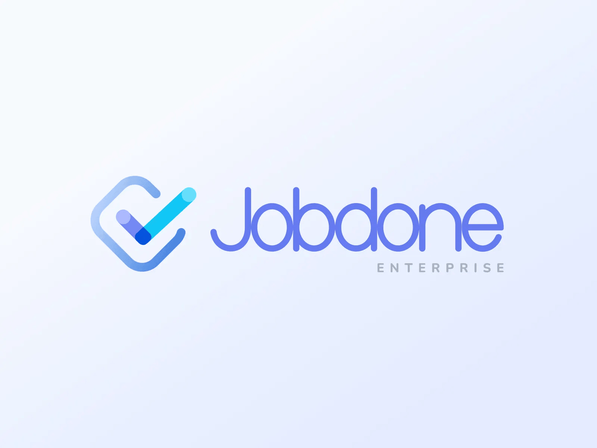
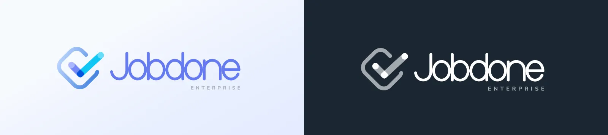
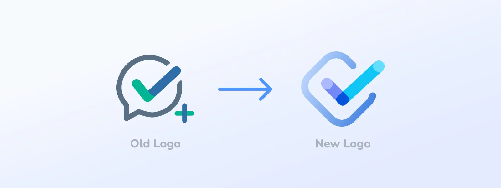
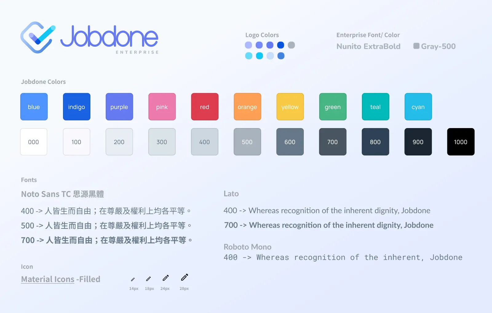
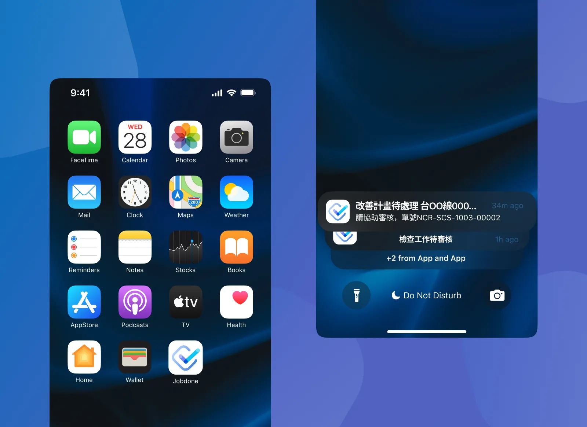

## 關於 Jobdone

Jobdone Enterprise 是一個專注在解決工程現場與場域維運相關議題的雲端平台。從營建到設備維運，Jobdone 協助您跨組織的串連起產業的上下游流程。

如果想了解更多相關資訊，歡迎上官網了解：
[Jobdone 官網](https://www.jobdone.cc)

## Logo 設計概念

這次的設計需求是因為產品需要進行重構，其核心概念從原本強調改善工地現場的溝通，進一步升級為「串連起溝通的斷點」。於是，在 Logo 設計上改變了打勾的方式，使用點與點連接起打勾符號，象徵溝通的串連。

## 品牌視覺系統

### 顏色系統

藍色是被公認最適合生產工具的顏色，但也因此以藍色為主色的產品太多了，所以在選定主色時，為了做出差異化，選用了與藍色相近的紫色，並且以藍色作為輔色。其餘的色彩依照主色延伸，皆帶有一點藍色調。

### 形狀設計

以打勾圖示為 Logo 的產品多以圓形作為外框，同樣為了有差異化，使用方形作為外框。而 Logo 與標準字保留原有圓潤的造型，維持親民的形象。

### Guideline 字體與圖示選用

由於產品多用於網頁，並且以繁體中文為主，所以在字體的選擇並不多，使用開源的思源黑體，其搭配的英文字體為 Lato，等寬字體為 Roboto Mono。圖示使用 Google Material Icons（Filled）。

---

本文最一開始發表於我的 [Dribbble](https://dribbble.com/shots/23068076-Jobdone-Branding) 上。
