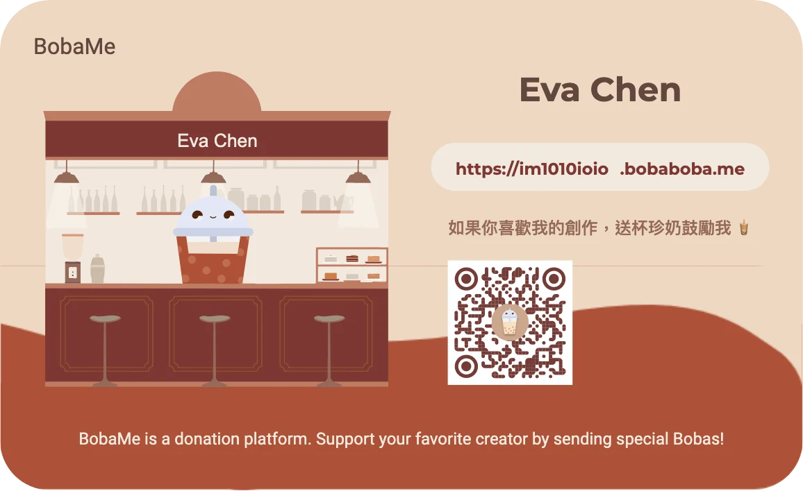

如果你也喜歡邊聽 YouTube 上的 [lofi girl](https://www.youtube.com/live/jfKfPfyJRdk?feature=share) 邊工作，  
那你可能會喜歡 Uniqlo 的 LifeWear Music 系列。

這系列是在 2021 推出，共有 4 部影片，  
都是 lofi 風格加上對應主題的白噪音，主題分別是：

1. 校園：下課後開始蔓延的想像力
2. 烹飪：充滿微笑的春天廚房日常
3. 露營：森林裡圍坐營火旁的寧靜
4. 辦公：音樂誕生時，時間的韻律

👇連結在下方👇
（官方的影片已下架，以下應該是其他人幫忙備份的）

<iframe width="560" height="315" src="https://www.youtube.com/embed/videoseries?si=bYyOitnQKZMw2B9Q&amp;list=PLQTDK3BGDQUhqrTUY2N4RdR6yaYSXppgK" title="YouTube video player" frameborder="0" allow="accelerometer; autoplay; clipboard-write; encrypted-media; gyroscope; picture-in-picture; web-share" referrerpolicy="strict-origin-when-cross-origin" allowfullscreen></iframe>

其中我最喜歡的就是第 2 部「充滿微笑的春天廚房日常」。

<iframe width="560" height="315" src="https://www.youtube.com/embed/HRIgVpZOz8Q?si=UqcenSWB5pAgE2dB" title="YouTube video player" frameborder="0" allow="accelerometer; autoplay; clipboard-write; encrypted-media; gyroscope; picture-in-picture; web-share" referrerpolicy="strict-origin-when-cross-origin" allowfullscreen></iframe>

明快又不搶戲的旋律，加上一些細碎的碗盤敲擊聲、交談聲，  
就像在一個溫暖的晴日，邊工作邊等待著餐點上桌。  
（話說，食物看起來很新鮮、很好吃欸。）

在當時疫情升溫，足不出戶的期間，  
帶給我的居家辦公時光一些明亮的色彩。

---

#### ↓↓↓↓↓↓↓↓↓↓↓↓↓↓↓↓↓↓↓↓

感謝看到最後的你，若你覺得獲益良多，請不要吝嗇給我按個喜歡。❤️

如果你喜歡我的創作，還想看看其他有趣的分享與日常，  
可以追蹤我的 IG → [@im1010ioio • Instagram 相片與影片](https://www.instagram.com/im1010ioio/)

或者是，  
送杯珍奶鼓勵我 → [🧋https://](https://im1010ioio.bobaboba.me/)[im1010ioio.bobaboba.me/](http://im1010ioio.bobaboba.me/)

