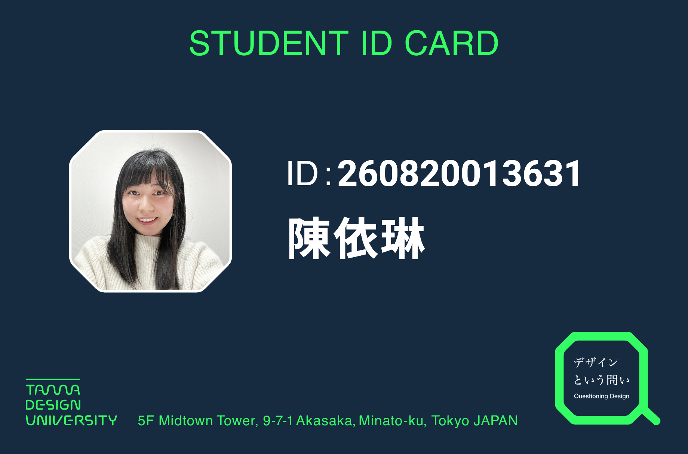

# 現況

這個頁面是依照 [Derek Sivers 所推廣的 now 運動](https://nownownow.com/about) 所建立的，用途就像是告訴一年沒見的朋友你最近在忙什麼。我打算在一年內持續更新這一頁，每年年初清空重置一次，過往紀錄未來可查看[版空紀錄](https://github.com/im1010ioio/im1010ioio/commits/main/src/content/now/now.md)。

## 📍 居住

台灣，台北

## ⏳ 最近的狀態

最近因為 bento 要關閉，而且 Hashnode 部落格怪怪的（莫名其妙刪文），感到很困擾，所以決定來自架部落格，所以有了你目前看到的頁面。

育有一女，雖然是假日父母，但是有這些 side project 所以還是很忙碌。
最近參加小行星集章活動，趁此機會帶小孩到處去玩。

## 💭 最近的想法

在一直變動的時代，我反而想尋找的是那些不變的東西，那些不變的，都是核心。
最近發現自己是設計總監（？），要改變許多做事的態度。

確立了我的設計理念：

- 降低設計師的創作者印記，讓設計依據系統產生自己的樣貌
- 形式即是內容

## 💼 最近做的事

- 今年的 365 天的秒速日記 Notion 模板也上架囉！
- Super Easy CSS 終於快要完結啦！
- 剛從上海旅行回來囉！但是旅行時生病了一場病，回來後反省生活作息與工作平衡。
- 買了麥克風，試著錄音講故事給小孩，很有趣！
- [Super Easy CSS 部落格](https://css.im1010ioio.dev/) 終於加上主視覺等等的細節啦！並且，將太長的文章拆分開來，最後變成 105 篇教學文章了。
- 研究策略性溝通
- 開始看多摩美術大學推出 [多摩設計大學免費課程](https://www.youtube.com/@tubtamaartuniversitytub3703) （下載逐字稿後，用 AI 翻譯並做重點筆記），居然還拿到了 [學生證](https://tub.tamabi.ac.jp/tdu/admission/) （他們鼓勵大眾學習設計知識，所以只要填寫表單就有），真有趣！
  
- 開始使用 Obsidian 整理自己的 Markdown 筆記

## 📺 最近娛樂

### 書籍

最近決定要善用圖書館資源，發現買了的書沒有還書期限，所以都沒有看完。😂

- 成功，從聚焦一件事開始 (2025/12/29)
- 華氏 451 度 (2025/01/07)
- 致富心態 (2025/01/27)
- ~生活的藝術：52個打造美好人生的思考工具~ (2026/03/25 放棄)
- 臺灣漫遊錄 (2026/06/04)
- ~張愛玲譯作選二：老人與海．鹿苑長春 (2026/07/03 放棄)~
- ~納瓦爾寶典 (2026/07/09 放棄)~
- 挺身而進
- 快速致富
- 失控的焦慮世代

### 戲劇

- 繁花
- 百年孤寂

### 動漫

- 寶石之國
- 葬送的芙莉蓮
- 我推的孩子
- 魔法帽的工作室
- 穹廬下的魔女
- 我是不才惡女

### 遊戲

最近開始數位排毒，不想被遊戲綁住，暫停玩所有手遊了。

- ~無限暖暖~
- ~Pikmin Bloom~
- Just Dance
- 瑪利歐賽車
