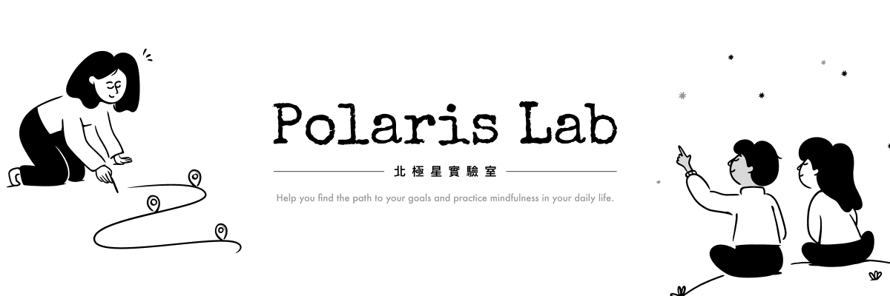
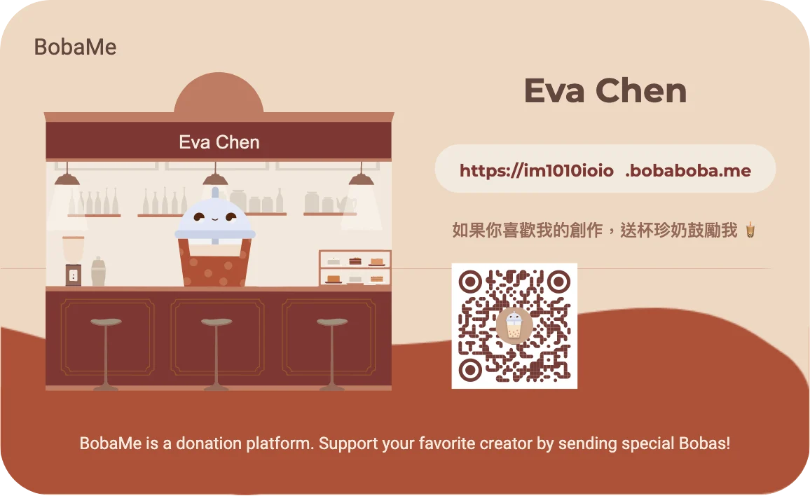

## 中文版

### 🌟 為什麼這個帳號叫作北極星實驗室呢？

其實最一開始叫作「小鬧劇實驗室」，是我在上架 LINE 貼圖時的創作者名稱。

會叫作「實驗室」是因為我想實驗各種 LINE 貼圖的可能性，例如：超快速做文字貼圖、用貼圖來排班表等等。

而「小鬧劇」則是來自[葛洛力《小鬧劇》這首歌](https://youtu.be/PNBl3-1USHo?si=0Qr-3McdRVhxPxBD)：

> 我的人生盡是些上演不完的小鬧劇  
> 沒有大惡大壞的人　沒有不可抗拒的災難  
> 有的就是我和身邊那一票人

我一開始想表達的是，貼近使用者的日常生活，日常細節的趣味與巧思。

---

後來，我想要找個地方來創作我的 Notion 模板，我想說可以把所有的創作組合在一起（除了技術文章），然後設計、行銷、自媒體都可以一起在這裡實驗。不然每個都那麼小，分太多品牌太累了。

可是，「小鬧劇」太難翻譯成英文了，英文直翻的話，這個語境怎麼樣都太像戲劇，脫離了「日常」與「小確幸」太多，所以我必須要換個名字。

---

我想了想——用 Notion 都是為了要管理生活、管理工作、管理目標。

這讓我聯想起——古代在航海時，都是依據北極星在前進，於是名稱就從「小鬧劇」成為了「北極星」。

並且，我想創作的 Notion 模板，其中一個期望是要在日常中落實正念的概念（因為目前市面上沒有太多正念相關的 Notion 模板），所以有發光的事物作為代表好像也挺不錯的。

Ruowen Huang 說過：

> 最好的修行就是好好生活。

現在這是北極星實驗室的核心精神，讓自己覺察日常的一步一腳印是不是在自己想要的道路上，或是讓自己的日常生活有些小趣味。

---

這個品牌純粹是想當成我的實驗成果分享，雖然我是文組的，但是「大膽假設，小心求證」一直以來，是我的核心思想之一。

所以也沒有打算真的要賺錢，就當作是我的興趣使然吧！未來大多分享都是免費或小額的，佛心分享，佛系經營喔！

設計與計劃，一切都很隨性（我是妥妥的 P 人 XD）。

雖然我也明白，有時有些事情是——需要付費，人們才會覺得有價值、會珍惜。

但因為我沒有要盈利，沒有要什麼回報，是做興趣，身體健康的，所以沒關係啦！XD

於是乎，秉持的公益精神，就來試試看「豐盛冥想所說『當你和世界分享你的天賦與才華，就能迎接豐盛 (abundance)』」是不是真的吧！

讓我們一起來實驗吧！

---

**如果您喜歡我的創作或覺得有幫助，可以考慮支持我！**

🧋 [買杯珍珠奶茶給我](https://im1010ioio.bobaboba.me/) 表達對我的支持，並且幫助我創造更多精彩的創作。

你們的每個鼓勵對我來說都非常重要。謝謝你！🥰

---

## English Version

### 🌟 **Why is this account called Polaris Lab?**

Originally, it was named "Little Farce Lab," which was the creator name I used when I first launched my LINE stickers.  
I chose the term "Lab" because I wanted to experiment with various possibilities for LINE stickers, such as quickly creating text-only stickers or using stickers to create scheduling charts.  
As for "Little Farce," it comes from [the song _Little Farce_ by Glory](https://youtu.be/PNBl3-1USHo?si=0Qr-3McdRVhxPxBD):

> _"My life is full of endless little farces._  
> _No great villains or irresistible disasters._  
> _Just me and the group of people around me."_

At first, I wanted to convey a sense of being close to the user's daily life, highlighting the small joys and clever details of everyday moments.

---

Later, when I was looking for a platform to create and share my Notion templates, I thought I could combine all my creations (except technical articles) under one name. This would allow me to integrate design, marketing, and social media experiments in one place, rather than juggling multiple small brands, which can be exhausting.  
However, "Little Farce" was too difficult to translate into English. A literal translation into English sounded overly dramatic and lost the essence of "everyday life" and "small happiness." So, I had to come up with a new name.

---

I thought about it—using Notion is all about managing life, work, and goals.  
This reminded me of the Polaris (North Star), which ancient sailors used to navigate their journeys.  
Thus, the name evolved from "Little Farce" to "Polaris."

Additionally, one of my goals in creating Notion templates is to incorporate mindfulness into everyday life (since there aren’t many mindfulness-focused Notion templates on the market). Having a luminous symbol as part of the brand seemed fitting.

Ruowen Huang once said:

> _"The best spiritual practice is living your life well."_

This has become the core philosophy of Polaris Lab—encouraging self-awareness in daily life, find your north star, making sure each step aligns with one's desired path, and bringing a little joy and creativity into the everyday.

---

This brand is purely a platform to share the results of my experiments. Even though I come from a humanities background, "bold assumptions and careful validation" has always been one of my core beliefs.  
Since it’s purely driven by interest, I don’t intend to make a profit. Most of the content I share will be free or at a low cost—a heartfelt sharing and a laid-back operation!  
The design and planning are all very casual (I’m a textbook example of a "P" MBTI type, haha).

That said, I do understand that sometimes, things that come with a price tag are often more valued and appreciated by people.  
But since I’m not aiming for profit or seeking anything in return, it’s all about my passion and well-being, so I’m fine with it!

With this in mind, let’s test the idea proposed in 21 Days of _Abundance Meditation Challenge_:

> _"When you share your talents and gifts with the world, you invite abundance."_

Let’s experiment together!

---

**If you enjoy my creations or find it helpful, consider supporting me!**

🧋 [Buy me a Boba Tea](https://im1010ioio.bobaboba.me/) to show your support and help me create more amazing resources.

Your encouragement means the world to me. Thank you! 🥰
